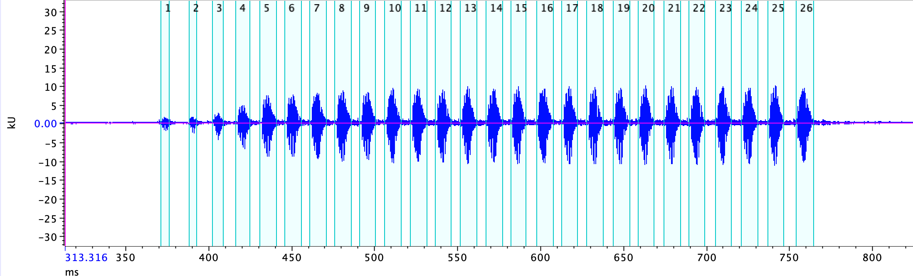

```{r setup, include=FALSE}
knitr::opts_chunk$set(echo = TRUE)
```

```{r echo = TRUE, warning = FALSE, message = FALSE}
library(seewave) # For audio analyses.
library(tuneR) # For loading audios.
library(scales) # For the alpha() function to make colors transparent.
library(shiny) # For interactive documents.
library(knitr) # For nice looking tables.


# Colorblind friendly colors. ----
blue_col <- "#004488"
red_col <- "#BB5566"
yellow_col <- "#DDAA33"

# Folder with .wav files. ----
wav_folder <- "/audio_files/"

# Load the "Hyla_test.wav" file. ----
wav <- readWave(paste0(getwd(), wav_folder, "Hyla_test.wav")) #requires package 'tuneR'.

```


## 1) Changing the parameters used for computing temporal envelopes.

```{r echo=FALSE}
inputPanel(
  #selectInput("wl", label = "Number of samples in window:",
   #           choices = c(4, 8, 16, 32, 64, 128, 256, 512, 1024, 2046), selected = 512),
  
  sliderInput("wl", label = "Number of samples in window:",
              min = 4, max = 2048, value = 512, step = 1),
  
  sliderInput("ovlp", label = "Overlap between windows:",
              min = 0, max = 0.99, value = 0.5, step = 0.01),
  
  radioButtons("envt_type", label = "Choose a type of envelope:",
               choices = c("abs", "hil"), selected = "abs")
)

renderPlot({
  par(mfrow = c(1, 2), mar = c(4.1, 4.1, 0.28, 0.28)) # Just to create a figure with 1 row 
  
  #Full oscillogram
  oscillo(wave = wav, colwave = "grey50")
  par(new = TRUE)
  env(wav, 
      envt = as.character(input$envt_type),
      colwave = red_col, 
      msmooth = c(as.numeric(input$wl), as.numeric(input$ovlp))
      )
  
  #Zoom in 0.05s
  oscillo(wave = wav, from = 0.61, to = 0.66, colwave = "grey50")
  par(new = TRUE)
  env(wav, 
      from = 0.61, to = 0.66, 
      colwave = red_col,
      envt = as.character(input$envt_type),
      msmooth = c(as.numeric(input$wl), as.numeric(input$ovlp))
      )
  
  
})
```


## 2)] Detecting calls with `timer()`

Now that we know the basics about amplitude envelopes, we can use them to detect calls automatically. The `timer()` function in the `seewave` package computes the amplitude envelope of a waveform, and then detects calls using an **user-defined amplitude threshold**. We need to also define the:

1.  window's size (in samples)
2.  overlap between windows (as a percentage)
3.  amplitude threshold (as a percentage)
4.  power exponential (numeric)
5.  minimum duration for the detection (in seconds)
6.  type of envelope (abs or hil)


Let's try to detect the pulses in the sample call with a Shiny app:


```{r, echo=FALSE, fig.align='center', fig.dim=c(2, 2)}

wl_detect <- 128  # samples
ovlp_detect <- 99 # percentage
thrs_detect <- 5  # percentage
pwr_detect <- 1.2 # exponential applied to oscillogram
dmin_detect <- 0.004 # minimum duration for detections

inputPanel(
  selectInput("wl_2", label = "Window's size (samples):",
              choices = c(4, 8, 16, 32, 64, 128, 256, 512, 1024, 2048), selected = wl_detect),
  
  #sliderInput("wl", label = "Window's size (samples):",
   #           min = 4, max = 2048, value = wl_detect, step = 1),
  
  sliderInput("ovlp_2", label = "Overlap between windows (%):",
              min = 0, max = 99, value = ovlp_detect, step = 1),
  
  sliderInput("thrs_2", label = "Threshold (%):",
              min = 1, max = 50, value = thrs_detect, step = 1),
  
  sliderInput("pwr_2", label = "Power factor (numeric):",
              min = 1, max = 5, value = pwr_detect, step = 0.1),
  
    sliderInput("dmin_2", label = "Mininum duration (seconds):",
              min = 0.001, max = 0.009, value = dmin_detect, step = 0.001),
  
  radioButtons("envt_type_2", label = "Choose a type of envelope:",
               choices = c("abs", "hil"), selected = "abs")
)

renderPlot({
 
par(mfrow = c(2, 1), mar  = c(4.1, 4.1, 1, 1))
detection <- timer(wave = wav,
                   threshold = as.numeric(input$thrs_2),
                   msmooth = c(as.numeric(input$wl_2),   as.numeric(input$ovlp_2)),
                   envt = as.character(input$envt_type_2),
                   power = as.numeric(input$pwr_2),
                   dmin = as.numeric(input$dmin_2),
                   tlim = c(0.35, 0.8),
                   plot = TRUE)


# Create df with start and end times of detections
det_df <- cbind(detection$s.start, detection$s.end)
# Obtain the maximum amplitude value of the oscillogram, for polygons
y <- max(abs(wav@left))

# lapply loop to create polygons from det_df.
dat<- 
lapply(1:nrow(det_df),
       function(x){
         res <- list(xx = c(det_df[x,], rev(det_df[x,])),
                     yy = c(-y, -y, y, y))
         return(res)
       })


# Plot oscillogram and detections as polygons
oscillo(wav, type="n", from = 0.35, to = 0.8)
#add polygons
invisible(lapply(dat, function(x){polygon(x$xx+0.35, x$yy, col = alpha("red", 0.25), border = NA)}))
par(new = TRUE)
oscillo(wav, from = 0.35, to = 0.8)
})
```

## 3) Export selection

If we have determined the parameter values that work better for our signal, we can run our definitive detection:
```{r, echo = TRUE, fig.align='center'}
# Define parameter values:
wl_detect <- 128  # samples
ovlp_detect <- 99 # percentage
thrs_detect <- 5  # percentage
pwr_detect <- 1.2 # exponential applied to oscillogram
dmin_detect <- 0.004 # minimum duration for detections

# Run detector:
detection <- timer(wave = wav,
                   threshold = thrs_detect,
                   msmooth = c(wl_detect, ovlp_detect),
                   power = pwr_detect,
                   dmin = dmin_detect,
                   plot = FALSE)

# Export results as a table with the start and end times of detections (in seconds):
det_df <- cbind(detection$s.start, detection$s.end)
# Obtain the maximum amplitude of the oscillogram (for plotting polygons later):
y <- max(abs(wav@left))
# Create polygons:
dat<- 
lapply(1:nrow(det_df),
       function(x){
         res <- list(xx = c(det_df[x,], rev(det_df[x,])),
                     yy = c(-y, -y, y, y))
         return(res)
       })

# Plot oscillogram with detections:
oscillo(wav, type="n")
invisible(lapply(dat, function(x){polygon(x$xx, x$yy, col = alpha("red", 0.25), border = NA)}))
par(new = TRUE)
oscillo(wav)
```

Lets see what the output looks like:
```{r}
detection
```

Lets export this results as a selections table that can be read in Raven:
```{r}
  
# Function to create Raven readable file
  Raven.form <- function(dat.fram)
    {
    dat.fram[ , c("Selection", "View", "Channel", "Low Freq (Hz)", "High Freq (Hz)")] <- c( rep(1: nrow(dat.fram)), rep("Spectrogram 1", nrow(dat.fram)), rep(1, nrow(dat.fram)), rep(0, nrow(dat.fram)), rep(22050, nrow(dat.fram)))
    
    dat.fram <- dat.fram[, c("Selection", "View", "Channel", "Begin Time (s)", "End Time (s)", "Low Freq (Hz)", "High Freq (Hz)")]
    
    dat.fram
    }
  
  #Export selections in Raven format
  df0 <- as.data.frame(cbind("Begin Time (s)" = detection$s.start,
                             "End Time (s)" = detection$s.end))
  df.raven <- Raven.form(df0)

  kable(head(df.raven))
```

We can export the selections made with `timer()` as a .txt file that can be read in Raven Pro or Raven Lite (file: **Hyla_test.Table.1.selection.txt**)).
```{r, echo = TRUE}
write.table(df.raven, file = file.path("selections/Hyla_test.Table.1.selection.txt"),  quote = F, col.names = T, row.names = F, sep = "\t")
```

It should look something like this (if you used the same detection parameter values as me):


## 4) Test with a field recording...

Load the wav file provided by Michael in his email:
```{r}
# Load the "1G2G3BR4BR-B1-20190621.WAV" file. ----
wav_field <- readWave(paste0(getwd(), wav_folder, "1G2G3BR4BR-B1-20190621.wav"))
wav_field
```

Lets see if we can get an oscillogram. R is not great at displaying long audiofiles, but the `fastdisp = TRUE` argument may help...
```{r, fig.align='center', fig.dim=c(10, 4),  fig.show="hold"}
par(mfrow = c(1, 2), mar = c(4.1, 4.1, 0.28, 0.28)) # Just to create a figure with 1 row 

oscillo(wav_field, fastdisp = TRUE)
abline(v = c(90, 110), col = "red", lty = 2, lwd = 2)

oscillo(wav_field, from = 90, to = 110, fastdisp = FALSE)

```

One first approach to reduce noise is to filter out unwanted frequencies.
The calls of our frogs (H. chrysoscelis) have their main spectral components between 1 - 4 kHz.
But perhaps a filter between 2 - 4 kHz works better...
The `ffilter()` function can help us filter our sound:
```{r, fig.align='center', fig.dim=c(10, 4), fig.show='hold'}
par(mfrow = c(1, 2), mar = c(4.1, 4.1, 0.28, 0.28)) # Just to create a figure with 1 row 

f <- 44100
filter <- squarefilter(f = f, from = 2000, to = 4000) 

# If you want to have a look at the filter you can uncomment this line:
#plot(filter, type = "l")

wav_field_sqfilt <- fir(wav_field,
                      f = f,
                      wl = 1024,
                      custom = filter,
                      output = "Wave")

oscillo(wav_field_sqfilt, fastdisp = TRUE)
abline(v = c(90, 110), col = "red", lty = 2, lwd = 2)

oscillo(wav_field_sqfilt, from = 90, to = 110, fastdisp = FALSE)
```


Now lets run the `timer()` function through this filtered file using the parameters we defined before (wl, ovlp, threshold). Because there is background noise, we will have to play around with the `power` argument:
```{r, eval = TRUE}
# Run detector through 20 seconds of recording:
timer(wave = wav_field_sqfilt,
      tlim = c(90, 110),
      threshold = 10,
      msmooth = c(512, 50),
      power = 1.2,
      dmin = 0.1,
      plot = TRUE)
```

It doesnt look awful... so we can just try to go ahead and run the detection through th whole recording
```{r}
# Run detector:
detection_field <-
timer(wave = wav_field_sqfilt,
     # tlim = c(90, 110),
      threshold = 15,
      msmooth = c(512, 50),
      power = 1.1,
      dmin = 0.1,
      plot = FALSE)

#Export selections in Raven format
df0_field <- as.data.frame(cbind("Begin Time (s)" = detection_field$s.start,
                             "End Time (s)" = detection_field$s.end))
df_field <- Raven.form(df0_field)
head(df_field)
write.table(df_field, file = "selections/1G2G3BR4BR-B1-20190621.Table.1.selection.txt",  quote = F, col.names = T, row.names = F, sep = "\t")
```
